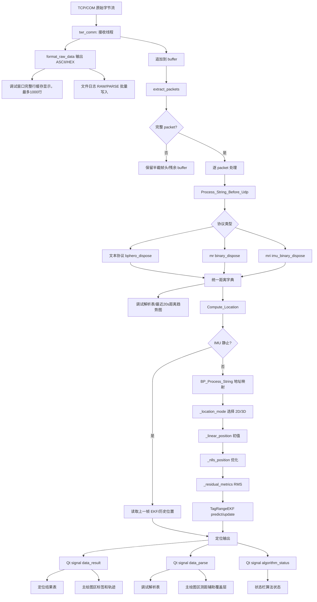

# UWB 定位算法方案

本文档描述当前工程已经落地的定位算法、协议适配、每标签 EKF 平滑、IMU 静止保持，以及从通信接收到 GUI 显示的完整数据流。

## 1. 算法目标

当前工程采用：

```text
线性最小二乘初值 + NLLS 非线性最小二乘优化 + 每标签 EKF 平滑
```

目标：

- 支持 3 基站二维定位。
- 支持 4 基站二维定位。
- 支持 4 基站三维定位。
- 支持未来多基站二维/三维扩展。
- 当前产品默认配置 4 个基站，其中基站 1/2/3 固定使能且不可取消，基站 4 默认使能但允许用户按需关闭。
- 当基站 4 关闭时，当前有效基站数为 3，执行 3 基站二维定位。
- 当 4 个启用基站 z 全部相等时，执行 4 基站二维定位。
- 当 4 个启用基站 z 不全相等时，执行 4 基站三维定位。
- 多标签互不影响，每个标签独立维护 EKF 状态。
- IMU 静止帧不使用 UWB 距离重新解算，只保持上一帧 EKF 结果。
- 状态栏输出算法模式、RMS、质量等级。

落地文件：

- `twr_main.py`
  - `twr_main`
  - `Process_String_Before_Udp`
  - `Compute_Location`
  - `_location_mode`
  - `_linear_position`
  - `_nlls_position`
  - `TagRangeEKF`
  - `cleanup_location_state`

- `Coordinate_process.py`
  - `BP_Process_String`
  - `Anthor_Coordinate_Process`
  - `Find_Anthor_Coor`

## 2. 协议适配

算法入口保持为：

```python
twr_main(input_string)
```

输入可以是：

- 文本协议字符串或 bytes。
- `mr` 二进制 bytes。
- `mri` 二进制 bytes。

### 2.1 文本协议

```text
&&&:LEN$TAG:SEQ$ANCHOR_ID:DIST_CM:RSSI#...$CRC####
```

解析函数：

```python
bphero_dispose(string)
```

输出：

```python
{
    "tag": tag_id,
    "seq": seq,
    "time": 0,
    "anthor_count": count,
    "anthor": [[anchor_id, distance_m, rssi], ...]
}
```

### 2.2 `mr` 二进制距离协议

长度：16 字节。

```text
m r 0x02 TAG_ID Frame_L Frame_H Dis0_L Dis0_H Dis1_L Dis1_H Dis2_L Dis2_H Dis3_L Dis3_H \r \n
```

解析函数：

```python
binary_dispose(packet)
```

距离规则：

- `DisX` 为小端 `uint16`。
- 单位为 cm。
- 软件内部转换为 m。

基站数量规则：

- 当前启用基站数量 `>= 4`：按 4 基站解析。
- 当前启用基站数量 `== 3`：按 3 基站解析；这通常对应基站 4 被用户取消使能的状态。
- 配置无法判断时，兼容旧规则：`Dis3 == Dis0` 视为 3 基站，否则 4 基站。

这样可以避免真实 4 基站场景中第 4 路距离刚好等于第 1 路距离时被误判为 3 基站。

当前 GUI 保证基站 1/2/3 始终使能，因此二进制协议正常运行时至少具备 3 个有效基站。基站 4 是否使能是 3 基站二维解算与 4 基站二维/三维解算之间的主要切换开关。

### 2.3 `mri` UWB+IMU 融合协议

长度：18 字节。

```text
m r i 0x02 TAG_ID Frame_L Frame_H Dis0_L Dis0_H Dis1_L Dis1_H Dis2_L Dis2_H Dis3_L Dis3_H s/m LF CR
```

解析函数：

```python
imu_binary_dispose(packet)
```

运动状态：

- `m`：运动，正常执行 UWB 定位和 EKF 更新。
- `s`：静止，不执行 UWB 定位，不更新 EKF 测量，保持上一帧该标签定位结果。

## 3. 分包与流式数据处理

TCP 和串口都是流式输入，可能出现：

- 一次读取多个完整帧。
- 一个完整帧被拆成多次读取。
- 帧头被拆开，如 `m`、`mr`、`mri`、`&`、`&&`、`&&&`。

分包函数：

```python
extract_packets(buffer)
```

行为：

1. 查找文本协议帧头 `&&&:`。
2. 查找 `mr\x02`。
3. 查找 `mri\x02`。
4. 提取完整包。
5. 对没有完整帧的尾部 buffer，保留最长可能帧头前缀。
6. 丢弃确定无用的噪声字节。

返回：

```python
packets, remain_buffer
```

### 3.1 串口读取与调试显示节流

当前串口接收逻辑位于 `twr_comm.py`：

- 串口打开参数为 `8N1`。
- 读取超时 `SERIAL_READ_TIMEOUT_S = 0.05s`，保证现场调试时日志显示足够流畅。
- 每轮读取先查看 `in_waiting`，然后执行 `read_size = min(max(1, in_waiting), 4096)`。
- Windows/pyserial 支持时尝试设置接收缓冲 `8192` 字节、发送缓冲 `2048` 字节。
- 原始字节仍然进入同一个 `extract_packets(buffer)` 分包器，算法输入不会因为 UI 日志刷新策略改变。

调试窗口的原始日志显示逻辑位于 `twr_debug_panel.py`：

- 可打印 ASCII 文本不会按每次串口 `read` 的块直接显示，而是按 `\r` / `\n` 缓存成完整行后显示。
- 半行文本保存在 `visible_raw_log_fragment`，避免高频读取时一条日志被拆成多行。
- 如果文本没有换行且 `0.45s` 内没有新字节，会强制补刷一次，避免界面看起来卡住。
- 二进制不可打印数据以 `HEX ...` 单行显示。
- 可见日志窗口最多保留 `1000` 行，待显示队列最多保留 `1000` 行。
- UI 定时器每 `100ms` 刷新一次，每次最多追加 `80` 行，防止日志风暴拖慢定位显示。

该节流只影响调试窗口的显示节奏，不改变协议分包、距离解析、定位解算、EKF 更新和文件日志保存。

## 4. 坐标映射

协议解析后仍只有基站地址和距离，需要映射到基站坐标。

入口：

```python
BP_Process_String(Input_String)
```

处理步骤：

1. 读取 `globalvar.get_anthor()`。
2. 查找与协议中 `anchor_id` 一致的启用基站。
3. 取出 `[x, y, z]`。
4. 刷新该基站 `time`，用于 UI 判断基站活跃状态。
5. 生成算法输入。

基站使能约束：

- 基站 1/2/3 在 GUI 层固定使能，因此坐标映射默认至少可以匹配 3 个基础基站。
- 基站 4 可选使能；关闭时，其距离数据即使存在也不参与坐标映射和定位解算。
- 地址匹配仍以 `short_address` 为准，不依赖表格行号；绘图编号仅用于用户显示。

算法输入：

```python
{
    "tag": tag_id,
    "seq": frame_seq,
    "count": valid_anchor_count,
    "anthor": [[x, y, z], ...],
    "distance": [d0, d1, d2, d3],
    "Rssi": [...]
}
```

## 5. 定位模式选择

函数：

```python
_location_mode(info)
```

规则：

| 条件 | 算法状态 | 维度 |
|---|---|---:|
| 有效基站数 < 3 | 等待数据 | 0 |
| 有效基站数 = 3 | 3基站二维定位，通常为基站 4 关闭 | 2 |
| 有效基站数 = 4 且 z 全相等 | 4基站二维定位 | 2 |
| 有效基站数 = 4 且 z 不全相等 | 4基站三维定位 | 3 |
| 有效基站数 > 4 且 z 全相等 | 多基站二维定位 | 2 |
| 有效基站数 > 4 且 z 不全相等 | 多基站三维定位 | 3 |

二维定位只使用 `[x, y]`，输出 `z = 0`。

三维定位使用 `[x, y, z]`，输出真实三维坐标。

## 6. 线性最小二乘初值

函数：

```python
_linear_position(anchors, distances, dimensions)
```

目的：

- 提供 NLLS 初始值。
- 检查基站几何是否可解。
- 不作为最终推荐输出。

数学模型：

```text
||p - a0||^2 = d0^2
||p - ai||^2 = di^2
```

两式相减：

```text
2(ai - a0) p = d0^2 - di^2 + ||ai||^2 - ||a0||^2
```

构造：

```text
A p = b
```

求解：

```python
np.linalg.lstsq(A, b)
```

失败条件：

- 2D：`rank(A) < 2`，基站共线或几何不足。
- 3D：`rank(A) < 3`，基站几何无法解析三维位置。

## 7. NLLS 非线性最小二乘

函数：

```python
_nlls_position(anchors, distances, dimensions, initial)
```

目标函数：

```text
min Σ(||p - ai|| - di)^2
```

残差：

```text
ri = ||p - ai|| - di
```

雅可比：

```text
Ji = (p - ai) / ||p - ai||
```

迭代使用阻尼 Gauss-Newton：

```text
(JᵀJ + λI) Δ = Jᵀr
p_new = p - Δ
```

阻尼策略：

- 新 cost 下降：接受更新，并减小阻尼。
- 新 cost 上升：拒绝更新，并增大阻尼。

冗余基站时使用 Huber 权重抑制异常测距：

```text
|r| <= 0.35m: weight = 1
|r| >  0.35m: weight = 0.35 / |r|
```

## 8. 残差与质量等级

函数：

```python
_residual_metrics(position, anchors, distances, dimensions)
```

输出：

- RMS 残差。
- 最大绝对残差。

质量等级：

| RMS | 等级 |
|---:|---|
| `<= 0.10m` | 优 |
| `<= 0.30m` | 良 |
| `<= 0.60m` | 警告 |
| `> 0.60m` | 差 |

状态栏格式：

```text
4基站二维定位 NLLS+EKF RMS:0.05m 质量:优
```

## 9. 每标签 EKF

类：

```python
TagRangeEKF
```

状态模型：

二维：

```text
[x, y, vx, vy]
```

三维：

```text
[x, y, z, vx, vy, vz]
```

运动模型：

```text
p = p + v * dt
v = v
```

过程噪声：

- 使用常速度模型。
- 加速度噪声默认 `1.40 m/s²`。
- `dt` 限制在 `0.02s..0.50s`，避免长时间无数据后预测过大。

测量模型：

```text
hi(x) = ||p - ai||
```

测量残差：

```text
zi - hi(x)
```

测量噪声：

```python
sigma = clamp(0.08 + 0.75 * RMS, 0.06, 0.90)
```

每个 tag 独立维护：

- `EKF_STATES[tag]`
- `LAST_LOCATION_RESULTS[tag]`
- `LAST_LOCATION_TIMES[tag]`

状态清理：

- TTL：`120s`
- 最大 tag 数：`64`
- 超时或超量时清理 EKF 和历史定位结果。

## 10. IMU 静止保持

当 `mri` 协议中 `motion_state == 's'`：

1. 不调用 `BP_Process_String` 重新解算。
2. 不执行 NLLS。
3. 不执行 EKF range update。
4. 如果该 tag 有 EKF 状态，返回 EKF 当前坐标。
5. 如果无 EKF 但有历史定位结果，返回历史结果。
6. 如果都没有，返回失败状态：

```text
IMU静止:无历史定位结果
```

成功保持状态：

```text
IMU静止:保持上次EKF定位结果
```

## 11. 完整数据流



## 12. 输出接口

`twr_main(input_string)` 返回：

```python
(location_result, seq, tag, x, y, z, algorithm_status)
```

字段说明：

- `location_result`：`1` 成功，`0` 失败或等待。
- `seq`：帧序号。
- `tag`：标签 ID。
- `x/y/z`：定位结果，单位 m。
- `algorithm_status`：给状态栏显示的算法状态。

## 13. 当前方案取舍

评估过的算法：

| 算法 | 优点 | 缺点 | 当前结论 |
|---|---|---|---|
| 线性最小二乘 | 快、简单 | 对噪声敏感，不能直接处理非线性误差 | 只作为初值 |
| NLLS | 精度高，适合三边/多边定位 | 需要较好初值 | 当前主解算 |
| 加权 NLLS | 可融合测距质量 | 需要可靠权重来源 | 预留，当前用 RMS 派生 EKF 测量噪声 |
| 鲁棒 Huber | 抑制异常距离 | 参数需现场调 | 已在冗余基站时启用 |
| EKF | 平滑轨迹，适合连续帧 | 需要维护状态 | 当前每标签平滑 |
| UKF/粒子滤波 | 非线性更强 | 算力和复杂度更高 | 暂不采用 |

最终落地：

```text
线性初值 + NLLS + Huber 冗余鲁棒 + 每标签 EKF
```

## 14. 算法相关依赖

定位算法依赖 `numpy` 完成矩阵和线性代数计算，包括：

- 线性最小二乘初值。
- 阻尼 Gauss-Newton NLLS。
- Huber 权重计算。
- EKF 状态预测、协方差传播、测距更新。

完整工程运行依赖位于：

```text
requirements.txt
```

跨 Windows、Linux、macOS 的安装说明见：

```text
DEPENDENCIES.md
```
