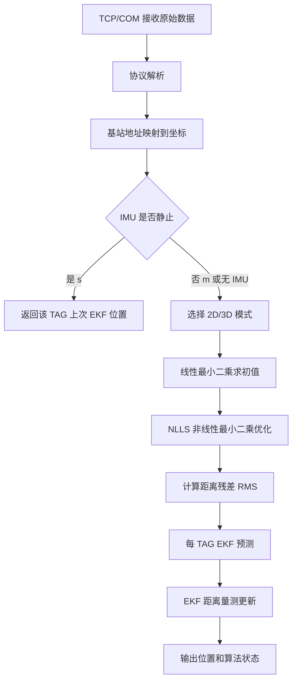

# UWB 定位算法方案

## 1. 方案目标

本工程的定位算法采用“NLLS 非线性最小二乘 + 每标签 EKF”的组合方案。整体目标如下：

- 支持 3 基站二维定位。
- 支持 4 基站二维定位。
- 支持 4 基站三维定位。
- 当 4 个使能基站的 `z` 全部相等时，自动执行 4 基站二维定位。
- 当 4 个使能基站的 `z` 不全相等时，自动执行 4 基站三维定位。
- 支持每个标签独立滤波，多个标签互不影响。
- 支持 IMU 静止状态控制：静止帧不使用 UWB 距离重新解算，保持上次 EKF 定位结果。
- 在状态栏输出定位算法状态、残差 RMS 和质量等级。

当前落地文件为：

- `twr_main.py`
  - `Compute_Location`
  - `_nlls_position`
  - `TagRangeEKF`
  - `_location_mode`
  - `_residual_metrics`

## 2. 输入数据与协议适配

算法入口仍保持 `twr_main(input_string)`，不改变 TCP、串口、调试解析页面的调用方式。

### 2.1 文本协议

格式：

```text
&&&:LEN$TAG:SEQ$ANCHOR_ID:DIST_CM:RSSI#...$CRC####
```

说明：

- `TAG` 为标签地址。
- `SEQ` 为帧序号。
- `ANCHOR_ID` 为基站地址。
- `DIST_CM` 为距离，单位为 cm，软件内部转换为 m。
- `RSSI` 当前不参与定位，仅保留给调试和扩展。

### 2.2 二进制距离协议

格式：

```text
m r 0x02 TAG_ID Frame_1 Frame_2 Dis0_L Dis0_H Dis1_L Dis1_H Dis2_L Dis2_H Dis3_L Dis3_H \r \n
```

说明：

- 总长度 16 字节。
- 距离为小端 `uint16`，单位 cm，软件内部转换为 m。
- 当第 4 路距离等于第 1 路距离时，判定为 3 基站数据。
- 否则判定为 4 基站数据。
- 基站地址按当前使能基站顺序绑定。

### 2.3 UWB + IMU 融合协议

格式：

```text
m r i 0x02 TAG_ID Frame_L Frame_H Dis0_L Dis0_H Dis1_L Dis1_H Dis2_L Dis2_H Dis3_L Dis3_H s/m LF CR
```

说明：

- 总长度 18 字节。
- `s` 表示静止。
- `m` 表示运动。
- 当 `motion_state == 's'` 时，不执行 UWB 距离解算，不更新 EKF 量测，只返回上次 EKF 结果。
- 当 `motion_state == 'm'` 时，正常执行 NLLS 和 EKF 更新。

## 3. 坐标映射流程

协议解析后会得到：

```python
{
    "tag": tag_id,
    "seq": frame_seq,
    "anthor": [[anchor_id, distance_m, rssi], ...],
    "motion_state": "s" or "m"
}
```

之后进入 `BP_Process_String`：

1. 根据 `anchor_id` 到 `globalvar.get_anthor()` 查找基站配置。
2. 仅使用 `enable == 1` 的基站。
3. 将基站地址转换为坐标 `[x, y, z]`。
4. 输出算法输入：

```python
{
    "tag": tag_id,
    "seq": frame_seq,
    "count": anchor_count,
    "anthor": [[x, y, z], ...],
    "distance": [d0, d1, d2, d3],
    "Rssi": [...]
}
```

## 4. 定位模式选择

函数：`_location_mode(info)`

规则：

| 输入条件 | 定位模式 | 解算维度 |
|---|---|---:|
| 3 个有效基站 | 3 基站二维定位 | 2D |
| 4 个有效基站且全部 `z` 相等 | 4 基站二维定位 | 2D |
| 4 个有效基站且 `z` 不全相等 | 4 基站三维定位 | 3D |
| 多于 4 个有效基站且全部 `z` 相等 | 多基站二维定位 | 2D |
| 多于 4 个有效基站且 `z` 不全相等 | 多基站三维定位 | 3D |

二维定位只使用 `[x, y]`，输出 `z = 0`。

三维定位使用 `[x, y, z]`，输出真实三维坐标。

## 5. 总体算法流程



## 6. 线性最小二乘初值

线性最小二乘只作为初值和几何有效性检查，不作为最终推荐输出。

对于第 1 个基站作为参考基站：

```text
||p - a0||^2 = d0^2
||p - ai||^2 = di^2
```

两式相减：

```text
2(ai - a0) p = d0^2 - di^2 + ||ai||^2 - ||a0||^2
```

构造：

```text
A p = b
```

使用：

```python
np.linalg.lstsq(A, b)
```

若 `rank(A) < dimensions`：

- 2D 判定为基站共线，定位失败。
- 3D 判定为基站几何不足，定位失败。

## 7. NLLS 非线性最小二乘

函数：`_nlls_position(anchors, distances, dimensions, initial)`

NLLS 直接最小化距离误差：

```text
min Σ ( ||p - ai|| - di )^2
```

其中：

- `p` 为标签位置。
- `ai` 为第 `i` 个基站坐标。
- `di` 为第 `i` 个 UWB 测距。

每轮迭代计算：

```text
ri = ||p - ai|| - di
Ji = (p - ai) / ||p - ai||
```

使用阻尼 Gauss-Newton：

```text
(JᵀJ + λI) Δ = Jᵀr
p_new = p - Δ
```

阻尼策略：

- 若本轮 cost 下降，接受更新，并减小阻尼。
- 若本轮 cost 上升，拒绝更新，并增大阻尼。

冗余基站场景下启用 Huber 权重：

```text
|r| <= 0.35m: weight = 1
|r| >  0.35m: weight = 0.35 / |r|
```

说明：

- 3 基站 2D 和 4 基站 3D 都是最小基站数，无法真正识别离群点，因此不启用鲁棒权重。
- 当基站数大于最小基站数时，Huber 权重可以降低 NLOS 单点异常对结果的影响。

## 8. 残差质量评估

NLLS 结束后计算：

```text
RMS = sqrt(mean((||p - ai|| - di)^2))
```

质量等级：

| RMS | 状态栏质量 |
|---:|---|
| `<= 0.10 m` | 优 |
| `<= 0.30 m` | 良 |
| `<= 0.60 m` | 警告 |
| `> 0.60 m` | 差 |

状态栏示例：

```text
定位算法:4基站三维定位 NLLS+EKF RMS:0.08m 质量:优
```

## 9. 每标签 EKF 设计

函数：`TagRangeEKF`

本工程使用每标签独立 EKF。每个 `TAG_ID` 对应一个 EKF 实例，存放在：

```python
EKF_STATES = {}
```

### 9.1 状态向量

二维：

```text
x = [px, py, vx, vy]ᵀ
```

三维：

```text
x = [px, py, pz, vx, vy, vz]ᵀ
```

其中：

- `p` 为位置。
- `v` 为速度。

### 9.2 预测模型

采用常速度模型：

```text
p(k) = p(k-1) + v(k-1) dt
v(k) = v(k-1)
```

状态转移矩阵二维示例：

```text
F = [
  1 0 dt 0
  0 1 0 dt
  0 0 1 0
  0 0 0 1
]
```

三维同理扩展到 6 维。

### 9.3 过程噪声

过程噪声按白噪声加速度模型构造：

```text
Q_axis = σa² [
  dt⁴/4  dt³/2
  dt³/2  dt²
]
```

当前参数：

| 参数 | 值 |
|---|---:|
| 默认 dt | `0.10 s` |
| 最小 dt | `0.02 s` |
| 最大 dt | `0.50 s` |
| 加速度噪声 `σa` | `1.40 m/s²` |

### 9.4 EKF 量测模型

EKF 直接使用 UWB 原始距离作为非线性量测，而不是仅对位置做低通滤波。

第 `i` 个基站量测：

```text
zi = di
h_i(x) = sqrt((px - aix)^2 + (py - aiy)^2 + ...)
```

Jacobian：

```text
H_i_position = (p - ai) / ||p - ai||
H_i_velocity = 0
```

EKF 更新：

```text
y = z - h(x)
S = HPHᵀ + R
K = PHᵀS⁻¹
x = x + Ky
P = (I - KH)P(I - KH)ᵀ + KRKᵀ
```

当前使用 Joseph 形式更新协方差，避免数值误差导致 `P` 非正定。

### 9.5 量测噪声

距离量测噪声由 NLLS 残差 RMS 自适应估计：

```text
sigma_range = clamp(0.08 + 0.75 * RMS, 0.06, 0.90)
```

含义：

- RMS 小，说明本帧测距一致性高，EKF 更信任 UWB。
- RMS 大，说明本帧可能存在遮挡、多径或异常测距，EKF 降低本帧权重。

### 9.6 EKF 初始化与重置

EKF 初始化位置来自 NLLS 结果。

以下情况会重建该标签 EKF：

- 新标签第一次出现。
- 同一标签定位维度从 2D 切换到 3D。
- 同一标签定位维度从 3D 切换到 2D。

## 10. IMU 静止控制

当 UWB + IMU 协议中的运动状态为 `s`：

1. 不执行线性最小二乘。
2. 不执行 NLLS。
3. 不执行 EKF 距离量测更新。
4. 返回该标签上次 EKF 位置。
5. 状态栏显示：

```text
定位算法:IMU静止:保持上次EKF定位结果
```

若该标签没有历史定位结果：

```text
定位算法:IMU静止:无历史定位结果
```

## 11. 关键参数

| 参数 | 当前值 | 说明 |
|---|---:|---|
| `NLLS_MAX_ITERATIONS` | 15 | NLLS 最大迭代次数 |
| `NLLS_INITIAL_DAMPING` | `1e-3` | 初始阻尼 |
| `NLLS_STEP_EPS` | `1e-5` | 迭代停止步长 |
| `NLLS_HUBER_THRESHOLD_M` | `0.35 m` | 冗余基站 Huber 阈值 |
| `EKF_DEFAULT_DT` | `0.10 s` | 默认帧间隔 |
| `EKF_MIN_DT` | `0.02 s` | 最小帧间隔 |
| `EKF_MAX_DT` | `0.50 s` | 最大帧间隔 |
| `EKF_PROCESS_NOISE_MPS2` | `1.40 m/s²` | 常速度模型加速度噪声 |
| `EKF_MIN_RANGE_SIGMA_M` | `0.06 m` | 最小测距噪声 |
| `EKF_MAX_RANGE_SIGMA_M` | `0.90 m` | 最大测距噪声 |

## 12. 评估结论

基于本工程基站规模和协议输入特点，算法选择结论如下：

| 算法 | 优点 | 缺点 | 本工程结论 |
|---|---|---|---|
| 线性最小二乘 | 快、实现简单、可做初值 | 噪声下偏差较大，3D 表现一般 | 保留为初值和几何检查 |
| NLLS | 直接拟合真实距离方程，精度高 | 需要初值和迭代 | 作为主定位解算 |
| Huber 鲁棒 NLLS | 可抑制冗余基站离群值 | 最小基站数时收益有限 | 多于最小基站数时启用 |
| EKF | 连续帧稳定，支持速度状态，每标签独立 | 参数需要调试 | 作为最终输出滤波 |
| PF 粒子滤波 | 非线性强、可表达多峰 | 算力高，参数复杂 | 暂不采用 |
| EKF 原始距离量测 | 直接融合 UWB 距离，模型完整 | 实现复杂度高于低通 | 已采用 |

仿真评估结果参考：

| 场景 | 线性最小二乘平均误差 | NLLS 平均误差 | 结论 |
|---|---:|---:|---|
| 2D 四基站，LOS，测距噪声 0.10 m | 0.103 m | 0.090 m | NLLS 更优 |
| 2D 三基站，LOS，测距噪声 0.10 m | 0.134 m | 0.112 m | NLLS 更优 |
| 3D 四基站，LOS，测距噪声 0.10 m | 0.275 m | 0.214 m | NLLS 明显更优 |
| 15% NLOS 异常 | 0.268 m | 0.238 m | NLLS 更稳，冗余基站时可进一步鲁棒化 |

最终推荐方案：

```text
线性最小二乘初值 + NLLS 主解算 + 原始距离 EKF 每标签融合 + IMU 静止保持
```

## 13. 失败处理

定位失败条件：

- 有效基站少于 3 个。
- 2D 基站共线。
- 3D 基站几何不足。
- 距离数量和基站数量不一致。
- 距离为负数。
- 解析协议失败。

失败时返回：

```python
(0, seq, tag, 0, 0, 0, algorithm + "失败")
```

其中第一个字段为 `location_result`，`0` 表示本帧无有效定位结果。

## 14. 对外输出

成功时返回：

```python
(1, seq, tag, x, y, z, algorithm_status)
```

字段说明：

- `1` 表示定位成功。
- `seq` 为帧序号。
- `tag` 为标签 ID。
- `x, y, z` 为最终 EKF 输出位置。
- `algorithm_status` 为状态栏显示文本。

示例：

```text
4基站二维定位 NLLS+EKF RMS:0.04m 质量:优
4基站三维定位 NLLS+EKF RMS:0.12m 质量:良
IMU静止:保持上次EKF定位结果
```

## 15. 复现注意事项

另一个研发机器人复现时需要保持以下行为完全一致：

1. 不改 TCP、串口、调试页面的数据入口。
2. 协议解析后统一进入 `Compute_Location`。
3. 先用 `BP_Process_String` 将基站地址转换成坐标。
4. 按 `_location_mode` 自动选择 2D 或 3D。
5. 先执行线性最小二乘，仅作为 NLLS 初值。
6. 再执行 NLLS，输出本帧位置观测和 RMS。
7. 每个 `TAG_ID` 独立维护一个 EKF。
8. EKF 的量测必须使用 UWB 原始距离，不能只做坐标低通。
9. IMU 静止帧必须跳过 UWB 解算和 EKF 量测更新。
10. 状态栏算法文本必须包含定位模式、`NLLS+EKF`、`RMS`、质量等级。
