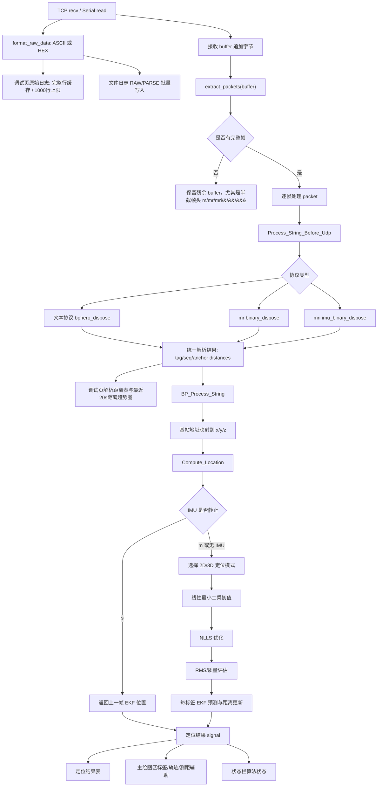

# 蓝点UWB-TWR 上位机V1.0 软件详细设计说明

本文档用于交给另一个研发机器人或工程师，使其能够基于本说明复刻出与当前工程功能、界面、流程、协议适配和数据流一致的软件。

## 1. 软件定位

软件名称：`蓝点UWB-TWR 上位机V1.0`

软件类型：Windows 桌面端 UWB TWR 定位调试工具。

技术栈：

- Python 3.7+
- PyQt5
- numpy
- pyserial
- TCP Server socket
- QGraphicsView / QGraphicsScene 绘图

依赖安装：

- 工程根目录提供 `requirements.txt`，用于 Windows、Linux、macOS 快速安装运行依赖。
- 完整跨平台安装说明见 `DEPENDENCIES.md`。

核心能力：

- 默认 4 个 UWB 基站配置：基站 1/2/3 固定使能且不可取消，基站 4 默认使能但允许用户按需取消。
- TCP 与串口 COM 两种通信方式二选一。
- 支持文本协议、`mr` UWB 二进制距离协议、`mri` UWB+IMU 二进制融合协议。
- 支持 3 基站二维定位、4 基站二维定位、4 基站三维定位，以及后续多基站扩展。
- IMU 静止状态下保持上一帧 EKF 定位结果，不重新使用 UWB 距离解算。
- 主绘图区支持 2D/3D 自动切换、缩放、鼠标拖动画布平移、3D 视角调节。
- 调试页支持原始数据、解析距离表、距离圆/连线图、按标签选择查看。
- 调试页原始日志按完整文本行显示，窗口最多保留 `1000` 行，避免高频串口数据造成 UI 卡死。
- 状态栏显示连接状态、定位算法状态、显示模式。
- 支持关闭时自动保存用户配置，并在下次启动时自动恢复基站、通信和绘图显示设置。
- GUI 启动时不弹出 Python terminal，Windows 标题栏和任务栏图标使用 UWB-TWR 定位主题图标。

## 2. 当前工程模块划分

正式入口：

- `UWB_Location_Tool.pyw`
  - 用户推荐双击入口。
  - 调用 `twr_51uwb_v2.main()`。

主窗口入口：

- `twr_51uwb_v2.py`
  - 只保留应用壳、Windows GUI 进程处理、图标加载、主窗口组装、程序入口。
  - 应用标题为 `蓝点UWB-TWR 上位机V1.0`，Windows AppUserModelID 为 `landian.uwb.twr.host.v1`。
  - 默认图标文件为 `uwb_location.ico`，图形语义为四基站、中心标签、测距环和定位连线。
  - `HuiTu` 通过 mixin 组合 UI、绘图、调试、通信控制。

UI 与功能模块：

- `twr_ui_layout.py`
  - 主界面代码化布局。
  - 屏幕分辨率自适应窗口尺寸。
  - TCP/COM 控件状态管理。
  - 状态栏、主题、窗口居中。

- `twr_plot.py`
  - 主定位画布。
  - 2D/3D 投影。
  - 基站、标签、轨迹、网格、测距辅助覆盖层。
  - 鼠标滚轮缩放、拖动画布平移、窗口 resize 后自动重绘。

- `twr_debug_panel.py`
  - 调试页原始日志。
  - 原始文本行缓存，避免串口小分片导致一行数据被拆成多行。
  - 可见日志窗口 `1000` 行上限、待显示队列 `1000` 行上限、单次 UI 刷新 `80` 行上限。
  - 解析面板。
  - 解析距离表。
  - 调试距离趋势图。
  - 文件日志保存。

- `twr_comm.py`
  - TCP Server。
  - 串口读取服务。
  - 接收缓冲、分包、逐包解析、异常隔离、Qt signal 输出。

协议和算法模块：

- `twr_main.py`
  - 数据包提取。
  - 文本协议、`mr`、`mri` 解析。
  - 3/4 基站数量判断。
  - NLLS 定位。
  - 每标签 EKF 平滑。
  - IMU 静止保持。
  - 算法状态输出。

- `Coordinate_process.py`
  - 基站地址到坐标映射。
  - 将协议解析结果转换为定位算法输入。

- `globalvar.py`
  - 全局基站配置。

辅助模块：

- `twr_config.py`
  - 用户配置文件路径管理。
  - JSON 配置读写。
  - 配置字段校验和默认值回退。
  - 启动时恢复基站数量、基站坐标、TCP 端口、默认 COM、波特率、历史数量、缩放比例、3D 视角和测距辅助状态。

- `uwb_logging.py`
  - 统一 logging 配置。
  - 默认关闭高频 debug 输出。
  - `UWB_DEBUG_LOG=1` 可打开调试日志。
  - `UWB_LOG_FILE=logs/debug.log` 可写入文件。

- `tools/run_tcp_open.pyw`
  - 开发/测试辅助入口，不作为正式用户入口。

## 3. 默认基站配置

软件默认只配置 4 个基站，启动时表格显示 4 行。

| 编号 | 地址 | enable | x | y | z |
|---:|---|---:|---:|---:|---:|
| 基站1 | `0x0001` | 1 | 0.0 | 0.0 | 0.0 |
| 基站2 | `0x0002` | 1 | 1.6 | 0.0 | 0.0 |
| 基站3 | `0x0003` | 1 | 1.6 | 1.6 | 0.0 |
| 基站4 | `0x0004` | 1 | 0.0 | 1.6 | 0.0 |

使能规则：

- 基站 1、基站 2、基站 3 是基础定位必需基站，启动时强制 `enable = 1`，界面勾选框保持勾选且禁用，用户不能取消。
- 基站 4 是可选增强基站，启动时默认勾选，未连接时用户可以取消或重新勾选。
- TCP 或 COM 打开后，基站 4 的使能勾选也随整张基站配置表一起锁定。
- 二进制 `mr/mri` 数据中如果 `Dis3 == Dis0`，该帧按 3 基站格式解析；第 4 路重复距离不参与定位，也不输出到绘图覆盖层。

基站编号规则：

- 按启用基站的 `short_address` 从小到大排序。
- 最小地址显示为 `基站1`，第二小显示为 `基站2`，依次类推。
- 绘图标签使用 `基站N` 加坐标：`(x, y, z)`。
- 坐标数字使用深色，括号与逗号使用蓝色强调。

表格规则：

- 未连接时允许编辑。
- 基站 1/2/3 的使能列不可编辑，其地址与坐标仍可在未连接时编辑。
- 基站 4 的使能列可在未连接时编辑。
- TCP 或 COM 打开后锁定表格。
- 关闭连接后解锁表格。
- 修改基站配置后更新 `globalvar`，清空标签历史并重绘画布。

## 4. 配置持久化设计

配置文件为 JSON，默认保存到当前操作系统的用户配置目录。

路径规则：

- Windows：`%APPDATA%\LandianUWB\TWRLocationTool\config.json`
- Linux：`~/.config/landian_uwb_twr/config.json`
- macOS：`~/Library/Application Support/LandianUWB/TWRLocationTool/config.json`
- 自动化测试可通过环境变量 `UWB_TWR_CONFIG_FILE` 指定临时配置文件。

配置保存时机：

- 用户关闭窗口并确认退出后，主窗口调用 `save_persistent_config()`。
- 保存成功后再停止文件日志、TCP Server 和串口服务。
- 保存失败不阻塞退出，仅通过 logging 记录 warning。

配置加载流程：

1. `HuiTu.__init__()` 创建基础 Qt Designer 控件后立即调用 `load_config()`。
2. 在 `configure_window_layout()` 之前恢复全局基站配置，因为表格行数和表格高度依赖当前基站数量。
3. 动态控件创建后恢复 TCP 端口、波特率、历史数量、3D 视角、测距辅助和通信默认 Tab。
4. 串口列表刷新后，优先选中上次保存的 COM 号；如果该 COM 当前不存在，则按 USB/CH340/CP210/FTDI/UART 优先级自动选择可用串口。
5. 首次绘图区绘制完成后恢复缩放比例，避免在空 scene 上设置 transform。

配置字段：

| 字段 | 类型 | 说明 |
|---|---|---|
| `version` | int | 配置格式版本，当前为 `1`。 |
| `anchor_count` | int | 保存时的基站数量。 |
| `anchors[]` | array | 基站配置数组。 |
| `anchors[].enable` | int | 基站使能状态；基站 1/2/3 启动后会强制为 `1`。 |
| `anchors[].short_address` | string | 基站短地址，例如 `0x0001`。 |
| `anchors[].x/y/z` | float | 基站坐标，单位 m。 |
| `communication.tcp_port` | int | TCP Server 监听端口。 |
| `communication.com_port` | string | 默认 COM 号，例如 `COM12`。 |
| `communication.baudrate` | int | 默认串口波特率。 |
| `communication.default_tab` | string | 启动后默认选中的通信页，`TCP` 或 `COM`。 |
| `display.history_count` | int | 每标签历史点数量，范围 `1..100`。 |
| `display.zoom_factor` | float | 主绘图区缩放比例，范围 `0.35..4.0`。 |
| `display.view_angle_deg` | int | 3D 视角角度，范围 `15..75`。 |
| `display.measurement_aid_enabled` | bool | 是否显示测距圆和距离连线。 |

容错规则：

- 配置文件不存在时使用默认配置。
- JSON 损坏、字段类型异常或数值越界时，使用默认值或裁剪到合法范围。
- 基站列表少于 3 个时补齐默认基站；基站 1/2/3 始终固定使能。

## 5. 界面设计

整体风格：

- 现代、高端商业风格，面向企业客户和专业工程用户。
- 风格方向为浅底银灰 + 克制海军蓝点缀，避免普通工具软件的粗糙感，也避免过深块面造成压迫。
- 主背景：`#F2F5F9`
- 面板背景：`#FFFFFF`
- 强调蓝色：`#2B5F89`
- 标题与正文深色：`#17324D` / `#162033`
- 表格表头：`#E4ECF5`
- 表格网格：`#D5DFEA`
- 控件边框：`#B7C6D8`
- 绘图区背景：`#F8FAFD`
- 基站在线点：`#155F8C`
- 基站离线/超时点：`#4F88B5`
- 网格线：`#8FA1B3`，全域虚线。

品牌与图标：

- 窗口标题显示 `蓝点UWB-TWR 上位机V1.0`。
- `QApplication.applicationName` 同步设置为 `蓝点UWB-TWR 上位机V1.0`。
- `QApplication.organizationName` 设置为 `蓝点UWB`。
- Windows AppUserModelID 使用 `landian.uwb.twr.host.v1`，保证任务栏图标分组与正式图标一致。
- 应用图标使用 `uwb_location.ico`，图标表达 UWB-TWR 定位场景：四个基站、中心标签、测距环、定位连线和蓝点品牌符号。

窗口自适应：

- 不固定为单一超大尺寸。
- 启动时根据当前屏幕可用区域计算窗口尺寸。
- `1366x768`、`1600x900`、`1920x1080`、`2560x1440`、`3840x2160` 均应保持相同布局比例并避免超出屏幕。
- Windows 125%、150% 显示缩放下启用 High DPI 支持。
- 窗口 resize 后主画布自动重算比例并重绘。

顶部区域：

1. 基站配置
2. 定位结果
3. 右侧通信与历史配置

通信区域：

- 分组标题：`通信`
- 内部使用 `QTabWidget`
- 软件启动后默认选中 `COM` Tab。
- Tab：
  - `TCP`
  - `COM`
- TCP 和 COM 互斥：
  - TCP 打开后禁用 COM。
  - COM 打开后禁用 TCP。

定位 Tab：

- 顶部工具栏分左右两组：
  - 左侧：缩放控制。
  - 右侧：3D 视图角度控制。
- 工具栏控件：
  - `缩放`
  - `-`
  - 当前缩放百分比
  - `重置`
  - `+`
  - `隐藏测距/显示测距`
  - `3D视图`
  - 视角滑块
  - 角度值，如 `35 deg`
  - `视角重置`

主绘图区：

- 默认 2D。
- 当启用基站数量不少于 4 且 z 不全相等时显示 3D。
- 2D 坐标原点默认位于左下角。
- 3D 显示仍保持 `(0,0,0)` 在左下基准方向。
- 网格线为全域虚线，颜色清晰但不过重。
- 基站点为较深蓝色，在线基站使用 `#155F8C`，离线/超时基站使用 `#4F88B5`。
- 标签支持多标签同时显示，不同标签不同颜色。
- 测距辅助可开关：
  - 基站为圆心的测距圆。
  - 基站到标签的距离实线。
  - 距离文字。

调试 Tab：

- 默认显示 TCP/COM 原始数据日志。
- 原始日志显示使用完整行缓存：
  - 可打印 ASCII 文本按 `\r` / `\n` 拼接成完整行后显示。
  - 半行数据会先保存在 `visible_raw_log_fragment`，避免串口读取过快时把一条日志切成多行。
  - 如果没有换行且 `0.45s` 内无新数据，会把残留片段作为一行补刷，避免界面看起来无响应。
  - 二进制不可打印数据以 `HEX ...` 单行显示。
- 原始日志 UI 性能限制：
  - `QPlainTextEdit` 最大保留 `1000` 行。
  - 待显示队列最大保留 `1000` 行，超过后丢弃最旧行。
  - 定时器每 `100ms` 刷新一次，每次最多追加 `80` 行。
- 打开解析后，调试页先左右分割，左右占比约 `50% / 50%`。
- 左侧继续显示 TCP/COM 原始数据日志。
- 右侧为解析视图，并在右侧内部上下分割：
  - 上方：解析后距离表，显示最新帧的标签、帧号、基站、距离、RSSI、状态。
  - 下方：距离趋势图，显示选中标签最近 `20s` 内到不同基站的动态距离变化曲线。
- 多标签时右上角下拉框选择某一个标签查看趋势。
- 按钮：
  - `开始/停止`
  - `清空`
  - `解析/关闭解析`
  - `日志/停止日志`
- 调试按钮只有 TCP 或 COM 连接成功后才可用。

状态栏：

- `连接状态:...`
- `定位算法:...`
- `显示模式:2D/3D`

## 6. 通信流程

### 6.1 TCP 流程

TCP 是服务端模式。

1. 用户点击 TCP Tab 的 `OPEN`。
2. 如果 COM 已打开，则 TCP 控件禁用，不能打开 TCP。
3. 校验端口范围 `1..65535`。
4. 自动获取本机 IP：
   - 通过 UDP connect 探测多个通用路由目标，如 `8.8.8.8`、`1.1.1.1`、`223.5.5.5`、`114.114.114.114`。
   - 再读取主机名解析到的 IPv4。
   - 去掉 loopback、link-local、multicast、unspecified。
   - 优先选择任意私有 LAN IPv4，包括 `192.168/16`、`10/8`、`172.16/12`。
   - 没有私有 IPv4 时选择其他可用 IPv4。
   - 最后兜底 `127.0.0.1`。
5. 创建 TCP socket：
   - `AF_INET`
   - `SOCK_STREAM`
   - `SO_REUSEADDR = 1`
   - `timeout = 0.5s`
   - `bind(("", port))`
   - `listen(5)`
6. 启动 accept 后台线程。
7. 每个客户端连接独立线程处理。
8. 每次 `recv(1024)`。
9. 原始数据通过 Qt signal 输出到调试窗口。
10. 追加到接收缓冲区。
11. 调用 `extract_packets(buffer)` 提取完整帧。
12. 逐帧调用协议解析与定位。
13. 单帧异常只记录日志并继续处理下一帧，不能退出接收线程。

### 6.2 COM 流程

1. 软件启动后默认停留在 COM Tab，用户也可以从 TCP Tab 手动切换回来。
2. 点击 `刷新` 后枚举 `serial.tools.list_ports.comports()`。
3. 如果存在历史选择则优先保持历史选择；否则优先选择非 Bluetooth 串口中包含 `USB`、`CH340`、`CP210`、`FTDI`、`UART` 关键字的真实硬件串口。
4. 波特率默认第一项为 `115200`，可选 `921600`、`460800`、`230400`、`57600`、`38400`、`19200`、`9600`。
5. 点击 `OPEN`。
6. 如果 TCP 已打开，则 COM 控件禁用，不能打开 COM。
7. 使用 pyserial 打开串口：
   - `8N1`
   - `timeout = 0.05s`
   - 尝试设置接收缓冲 `8192` 字节、发送缓冲 `2048` 字节。
8. 后台线程循环读取：
   - 每轮先读取 `in_waiting`。
   - `read_size = min(max(1, in_waiting), 4096)`。
   - 这样既能低延迟显示串口日志，也能避免一次读取过大造成 UI 压力。
9. 后续流程与 TCP 相同：原始日志、缓冲、分包、解析、定位、发信号更新 UI。

## 7. 协议格式支持

### 7.1 文本协议

```text
&&&:LEN$TAG:SEQ$ANCHOR_ID:DIST_CM:RSSI[#ANCHOR_ID:DIST_CM:RSSI...]$CRC####
```

说明：

- 文本协议是 ASCII 可变长度帧。
- 帧头固定为 `&&&:`。
- `LEN`、`TAG`、`SEQ`、`ANCHOR_ID`、`DIST_CM`、`RSSI` 建议全部使用十六进制 ASCII。
- `DIST_CM` 单位为 cm，软件解析后乘以 `0.01` 转为 m。
- 多个基站距离组使用 `#` 分隔。
- `CRC` 当前只作为保留字段，软件只检查帧尾 `####`，不校验 CRC 值。
- 帧结束标志固定为 `####`，不强制要求 `\r\n`。

字段结构：

| 字节/字符位置 | 字段 | ASCII/格式 | 说明 |
|---|---|---|---|
| 0 | `&` | `0x26` | 帧头第 1 字节 |
| 1 | `&` | `0x26` | 帧头第 2 字节 |
| 2 | `&` | `0x26` | 帧头第 3 字节 |
| 3 | `:` | `0x3A` | 帧头分隔符 |
| 4..N | `LEN` | 十六进制 ASCII | 当前仅校验为十六进制，不做长度强校验 |
| N+1 | `$` | `0x24` | Header 与标签字段分隔符 |
| 后续 | `TAG:SEQ` | 十六进制 ASCII | 标签 ID 与帧序号，中间用 `:` 分隔 |
| 后续 | `$` | `0x24` | 标签字段与基站距离字段分隔符 |
| 后续 | `ANCHOR_ID:DIST_CM:RSSI` | 十六进制 ASCII | 单个基站距离组 |
| 后续 | `#` | `0x23` | 多个基站距离组分隔符 |
| 后续 | `$` | `0x24` | 基站距离字段与 CRC 字段分隔符 |
| 后续 | `CRC` | 建议十六进制 ASCII | 当前版本不校验 |
| 末尾 4 字节 | `####` | `0x23 0x23 0x23 0x23` | 帧结束标志 |

示例：

```text
&&&:0048$0033:0001$0001:009D:00#0002:0096:00#0003:004F:00#0004:0057:00$0000####
```

### 7.2 `mr` UWB 二进制距离协议

总长度 16 字节：

| 字节 | 字段 | 说明 |
|---:|---|---|
| 0 | `m` | 帧头 1 |
| 1 | `r` | 帧头 2 |
| 2 | `0x02` | 协议版本 |
| 3 | `TAG_ID` | 标签 ID |
| 4 | `Frame_L` | 帧序号低字节 |
| 5 | `Frame_H` | 帧序号高字节 |
| 6-7 | `Dis0` | 基站 1 距离，cm，小端 |
| 8-9 | `Dis1` | 基站 2 距离，cm，小端 |
| 10-11 | `Dis2` | 基站 3 距离，cm，小端 |
| 12-13 | `Dis3` | 4 基站时第 4 路；3 基站时可重复第 1 路 |
| 14 | `\r` | 结束符 |
| 15 | `\n` | 换行 |

基站数量判断：

- 协议不可修改，没有显式基站数量字段。
- 如果 `Dis3 == Dis0`，按 3 基站帧解析，只输出 `Dis0/Dis1/Dis2`。
- 如果 `Dis3 != Dis0` 且当前启用基站数量不少于 4，按 4 基站解析。
- 如果当前启用基站数量为 3，按 3 基站解析。

### 7.3 `mri` UWB+IMU 融合协议

总长度 18 字节：

| 字节 | 字段 | 说明 |
|---:|---|---|
| 0 | `m` | 帧头 1 |
| 1 | `r` | 帧头 2 |
| 2 | `i` | 帧头 3 |
| 3 | `0x02` | 协议版本 |
| 4 | `TAG_ID` | 标签 ID |
| 5 | `Frame_L` | 帧序号低字节 |
| 6 | `Frame_H` | 帧序号高字节 |
| 7-14 | `Dis0..Dis3` | 4 路距离，cm，小端 |
| 15 | `s/m` | `s` 静止，`m` 运动 |
| 16 | `0x0A` | LF |
| 17 | `0x0D` | CR |

IMU 规则：

- `m`：执行正常 UWB 定位和 EKF 更新。
- `s`：不执行 UWB 距离解算，不更新 EKF 测量，直接保持上次该标签 EKF 位置。
- 如果该标签没有历史定位结果，返回失败状态并提示无历史结果。

## 8. 完整数据流



关键数据结构：

协议解析输出：

```python
{
    "tag": tag_id,
    "seq": frame_seq,
    "time": 0,
    "anthor_count": count,
    "anthor": [[anchor_id, distance_m, rssi], ...],
    "motion_state": "s" or "m"  # 仅 mri 协议存在
}
```

算法输入：

```python
{
    "tag": tag_id,
    "seq": frame_seq,
    "count": valid_anchor_count,
    "anthor": [[x, y, z], ...],
    "distance": [d0, d1, d2, d3],
    "Rssi": [...]
}
```

定位输出 signal：

```python
(seq, tag, x, y, z, algorithm_status)
```

## 9. 日志策略

代码内部不使用 `print` 输出高频数据，统一使用 `logging`。

默认：

- debug 日志关闭。
- GUI 模式下不弹出 terminal。

环境变量：

```text
UWB_DEBUG_LOG=1
UWB_LOG_LEVEL=DEBUG
UWB_LOG_FILE=logs/debug.log
```

调试页文件日志与内部 logging 是两套机制：

- 调试页 `开始/停止`：只控制窗口可见原始日志，窗口最多保留 `1000` 行。
- 调试页 `日志/停止日志`：面向用户记录通信数据和解析明文，只记录打开日志之后新收到的数据。
- 调试页可见日志使用完整行缓存，避免串口 `read` 分片导致一条文本日志被分割成多行。
- `uwb_logging.py`：面向研发记录内部诊断日志。

## 10. 线程与异常规则

- GUI 更新必须在主线程中完成。
- TCP/COM 服务线程只通过 Qt signal 向 UI 传递数据。
- `extract_packets` 必须保留半截帧头，避免 TCP/串口分包丢帧。
- 单帧解析/定位异常必须隔离，坏帧不能导致接收线程退出。
- 关闭窗口时必须停止文件日志、关闭 TCP socket、关闭串口。

## 11. 启动方式

正式用户入口：

```text
UWB_Location_Tool.pyw
```

开发辅助入口：

```text
tools/run_tcp_open.pyw
```

开发入口只用于自动打开 TCP 端口测试，不应放在根目录作为正式入口。

## 12. 依赖清单与安装

运行依赖清单位于：

```text
requirements.txt
```

依赖包：

| 依赖包 | 用途 |
|---|---|
| `PyQt5` | GUI 界面、表格、绘图视图、信号槽 |
| `numpy` | 线性最小二乘、NLLS、EKF 矩阵计算 |
| `pyserial` | 串口 COM 通信和串口枚举 |

快速安装：

```bash
python -m pip install --upgrade pip setuptools wheel
python -m pip install -r requirements.txt
```

跨平台说明：

- Windows：推荐使用 `py -3 -m venv .venv` 创建虚拟环境。
- Linux：可能需要安装 Qt xcb 运行库，并为串口访问配置 `dialout` 权限。
- macOS：串口通常使用 `/dev/cu.*` 设备名。
- 详细步骤见 `DEPENDENCIES.md`。
